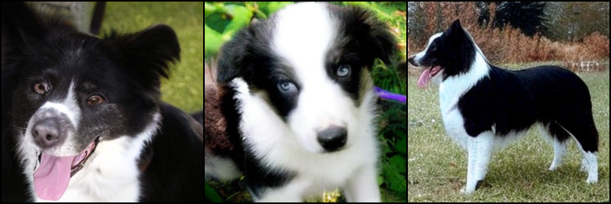
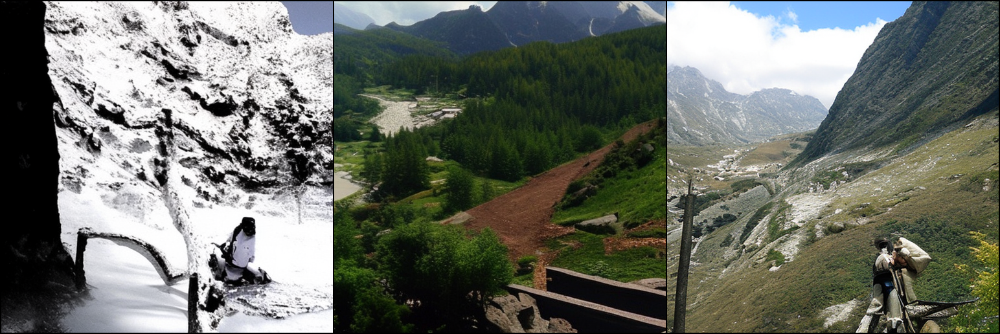
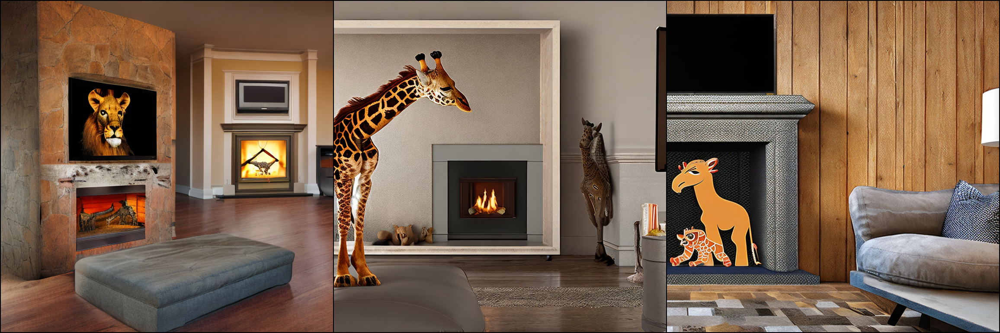

# CFG Adapter

## Preliminary results

The following shows samples from trained models without CFG, with CFG, and with the adapter. The sampling time of no CFG and with adapter is approximately equivalent. All samples were generated with the same seed for direct comparison.

### DiT-XL/2 (256x256)

  
Macaw

  

    
    &nbsp; &nbsp;
    
    &nbsp; &nbsp;
    
    
<b>Fig 1.</b> Samples of DiT-XL/2 (256x256) without CFG (left), with CFG (center), with CFG adapter (right) of <em>Macaw</em> (label 88).

  

  
Border Collie

  

    
    &nbsp; &nbsp;
    
    &nbsp; &nbsp;
    
    
<b>Fig 2.</b> Samples of DiT-XL/2 (256x256) without CFG (left), with CFG (center), with CFG adapter (right) of <em>Border Collie</em> (label 232).

  

  
Mushroom

  

    
    &nbsp; &nbsp;
    
    &nbsp; &nbsp;
    
    
<b>Fig 3.</b> Samples of DiT-XL/2 (256x256) without CFG (left), with CFG (center), with CFG adapter (right) of <em>Mushroom</em> (label 947).

  

  
Alp

  

    
    &nbsp; &nbsp;
    
    &nbsp; &nbsp;
    
    
<b>Fig 4.</b> Samples of DiT-XL/2 (256x256) without CFG (left), with CFG (center), with CFG adapter (right) of <em>Alp</em> (label 970).

  

### DiT-XL/2 (512x512)

  
Macaw

  

    
    &nbsp; &nbsp;
    
    &nbsp; &nbsp;
    
    
<b>Fig 5.</b> Samples of DiT-XL/2 (512x512) without CFG (left), with CFG (center), with CFG adapter (right) of <em>Macaw</em> (label 88).

  

  
Border Collie

  

    
    &nbsp; &nbsp;
    
    &nbsp; &nbsp;
    
    
<b>Fig 6.</b> Samples of DiT-XL/2 (512x512) without CFG (left), with CFG (center), with CFG adapter (right) of <em>Border Collie</em> (label 232).

  

  
Mushroom

  

    
    &nbsp; &nbsp;
    
    &nbsp; &nbsp;
    
    
<b>Fig 7.</b> Samples of DiT-XL/2 (512x512) without CFG (left), with CFG (center), with CFG adapter (right) of <em>Mushroom</em> (label 947).

  

  
Alp

  

    
    &nbsp; &nbsp;
    
    &nbsp; &nbsp;
    
    
<b>Fig 8.</b> Samples of DiT-XL/2 (512x512) without CFG (left), with CFG (center), with CFG adapter (right) of <em>Alp</em> (label 970).

  

### Stable Diffusion 2.1

  
<em>"A young badger delicately sniffing a yellow rose, richly textured oil painting."</em>

  

    
    &nbsp; &nbsp;
    
    &nbsp; &nbsp;
    
    
<b>Fig 9.</b> Samples of Stable Diffusion 2.1 without CFG (left), with CFG (center), with CFG adapter (right).

  

  
<em>"An empty fireplace with a television above it. The TV shows a lion hugging a giraffe."</em>

  

    
    &nbsp; &nbsp;
    
    &nbsp; &nbsp;
    
    
<b>Fig 10.</b> Samples of Stable Diffusion 2.1 without CFG (left), with CFG (center), with CFG adapter (right).

  

  
<em>"Monster Baba yaga house with in a forest, dark horror style, black and white."</em>

  

    
    &nbsp; &nbsp;
    
    &nbsp; &nbsp;
    
    
<b>Fig 11.</b> Samples of Stable Diffusion 2.1 without CFG (left), with CFG (center), with CFG adapter (right).

  

  
<em>"A grand piano with a white bench."</em>

  

    
    &nbsp; &nbsp;
    
    &nbsp; &nbsp;
    
    
<b>Fig 12.</b> Samples of Stable Diffusion 2.1 without CFG (left), with CFG (center), with CFG adapter (right).

  

### Stable Diffusion XL

  
<em>"An astronaut riding a pig, highly realistic dslr photo, cinematic shot."</em>

  

    
    &nbsp; &nbsp;
    
    &nbsp; &nbsp;
    
    
<b>Fig 13.</b> Samples of Stable Diffusion XL without CFG (left), with CFG (center), with CFG adapter (right).

  

  
<em>"A young badger delicately sniffing a yellow rose, richly textured oil painting."</em>

  

    
    &nbsp; &nbsp;
    
    &nbsp; &nbsp;
    
    
<b>Fig 14.</b> Samples of Stable Diffusion XL without CFG (left), with CFG (center), with CFG adapter (right).

  

  
<em>"A capybara made of voxels sitting in a field."</em>

  

    
    &nbsp; &nbsp;
    
    &nbsp; &nbsp;
    
    
<b>Fig 15.</b> Samples of Stable Diffusion XL without CFG (left), with CFG (center), with CFG adapter (right).

  

  
<em>"Cat patting a crystal ball with the number 7 written on it in black marker."</em>

  

    
    &nbsp; &nbsp;
    
    &nbsp; &nbsp;
    
    
<b>Fig 16.</b> Samples of Stable Diffusion XL without CFG (left), with CFG (center), with CFG adapter (right).

  

  
<em>"An empty fireplace with a television above it. The TV shows a lion hugging a giraffe."</em>

  

    
    &nbsp; &nbsp;
    
    &nbsp; &nbsp;
    
    
<b>Fig 17.</b> Samples of Stable Diffusion XL without CFG (left), with CFG (center), with CFG adapter (right).

  

  
<em>"Monster Baba yaga house with in a forest, dark horror style, black and white."</em>

  

    
    &nbsp; &nbsp;
    
    &nbsp; &nbsp;
    
    
<b>Fig 18.</b> Samples of Stable Diffusion XL without CFG (left), with CFG (center), with CFG adapter (right).

  

  
<em>"A close up of a handpalm with leaves growing from it."</em>

  

    
    &nbsp; &nbsp;
    
    &nbsp; &nbsp;
    
    
<b>Fig 19.</b> Samples of Stable Diffusion XL without CFG (left), with CFG (center), with CFG adapter (right).

  

